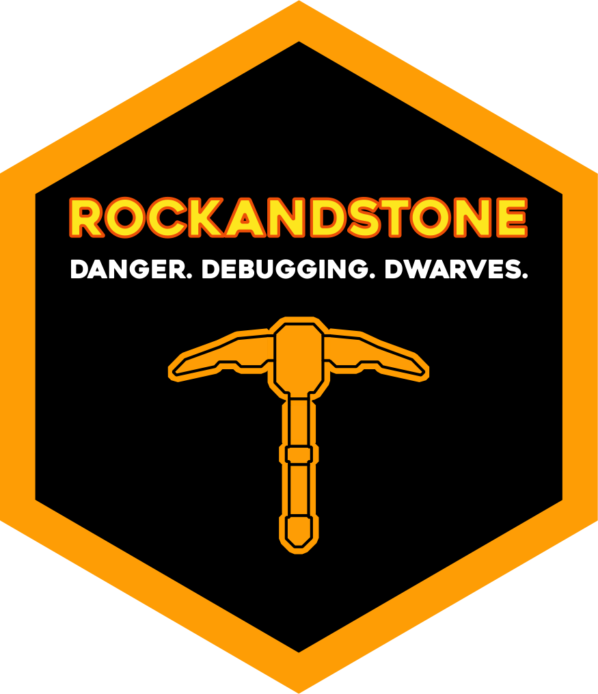

# rockandstone <a href='https://mccarthy-m-g.github.io/rockandstone/'></a>

<!-- badges: start -->
[](https://github.com/mccarthy-m-g/rockandstone/actions/workflows/R-CMD-check.yaml)
<!-- badges: end -->

> Gimme an R! Gimme an S! Gimme a Rock and Stone.

`rockandstone` is a package for playing voicelines from the video game [Deep Rock Galactic](https://www.deeprockgalactic.com) in R.

## Installation

Install the development version from [GitHub](https://github.com/) with:

```r
# install.packages("remotes")
remotes::install_github("mccarthy-m-g/rockandstone")
```

## Usage

```r
library(rockandstone)
```

By default the voiceline pool includes all "Safe For Work" voicelines.

```r
rockandstone()
```

"Not Safe For Work Voicelines" (with profanity) are opt-in.

```r
rockandstone(nsfw = TRUE)
```

The voiceline pool can also be reduced to certain categories and/or sentiments to suit your use case.

```r
rockandstone(category = "salute")
rockandstone(sentiment = "negative")
```

Voicelines can be played on error by setting the `error` argument in `options()`. This can be specified in startup files such as `.Rprofile` to make it persist across sessions. 

```r
options(error = function() rockandstone(sentiment = "negative"))
```

## Requirements

`rockandstone` currently uses the [`beepr`](https://github.com/rasmusab/beepr) package to play sounds in R.

### macOS and Windows

Sound playback is handled by the `audio` package and no external program is needed.

### Linux

Sound playback is handled by one of:

- paplay utility from the Pulse Audio system
- aplay utility from the ALSA system
- VLC media player installed and on the PATH
